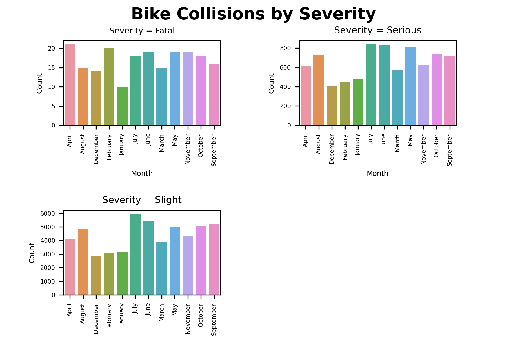

# bike-collisions-v
Visualization of bike collissions in London (2005-2019)

El dataset contiene datos acerca de accidentes en bicicleta producidos en Londres, entre los años 2005 y 2019. Se individualizan los accidentes mediante un ID único (Accident Index), y además se agregan detalles como el municipio y el barrio donde ocurrió (Borough y Ward, respectivamente), latitud y longitud del lugar físico (Latitude y Longitude), las víctimas (Casualties), la gravedad (Severity), enlaces donde se guarda información respecto al accidente (Url), número de victimas (Number of Casualties) y número de vehículos involucrados (Number of Vehicles).
Se realizaron filtros al dataset para separar los datos de acuerdo a la gravedad del accidente, y posteriormente se graficó el número de accidentes por mes, de acuerdo a la gravedad de los mismos.

